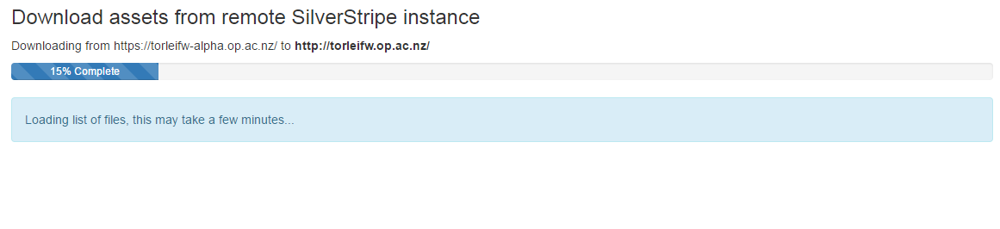
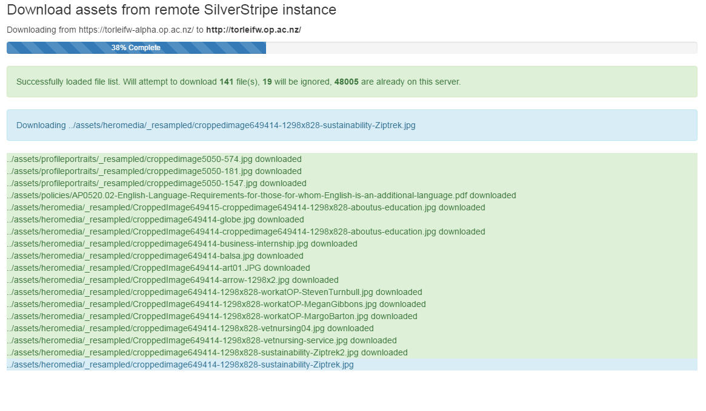

Remote Asset Synchronisation Task
=================================

### Downloads files from a remote server.

An easy to use task that downloads all the publicly accessable resources in assets/*





### Installation

 - **composer install otago/remote-asset-download**
 - create your own yml **mysite/_config/remoteassetssync.yml** (see below)
 - make sure that the yml and the module are both on the target and local machine

```
---
Name: RemoteAssetTask
---
RemoteAssetTask:
  target: https://remotedownloaddomain.com/
  key: url_friendly_passprase
  excludedfolders:
    - /static-cache
    - /largefiles
    - /_generated_pdfs
```

Your passphrase should be unique, and hard to guess, and URI friendly. This will prevent the public
from retrieving a list of your assets.


### How it works

By running **/dev/tasks/RemoteAssetTask** your browser sends an ajax request
to your server which will compare its file list against the target computer.

Your browser will then one by one send a request to download each file to your local server.


### Notes

 - The task will download *new* files
 - pick a robust secret key in the yml file and **use HTTPS**
